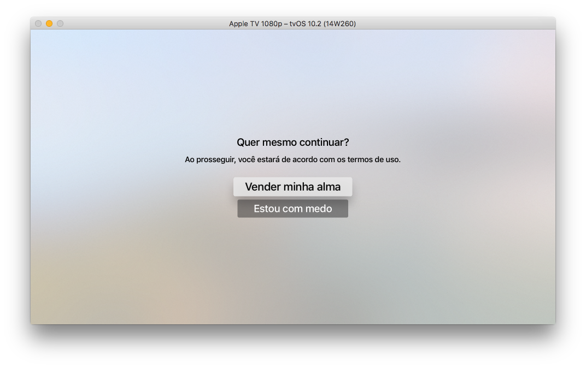
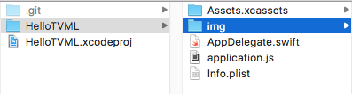
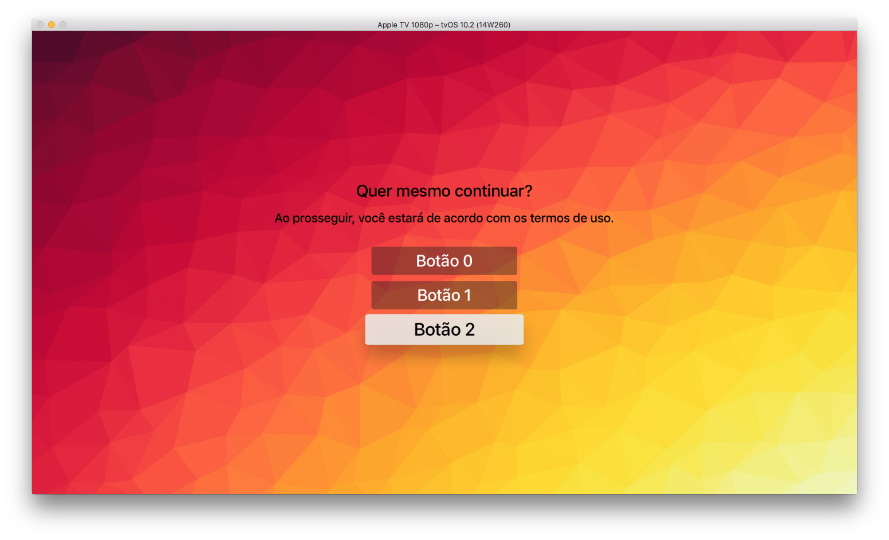

# Olá, TVML!

Antes de iniciar a programação, certifique-se de que o projeto está configurado corretamente e
você está com o servidor em execução. Você pode encontrar como fazer isso [aqui](INITIAL_SETUP.md).

### Começando do zero
Primeiro, vamos iniciar pelo começo. Abra o arquivo `application.js` e apague tudo que tiver nele. 
Substitua o conteúdo por este simples código:  
``` js
App.onLaunch = function(options) {

}
```

Quando o app iniciar, ele chamará a função `onLaunch` que está dentro da classe App. Nesse caso, estamos
apenas declarando o código que será executado nesta chamada de função.

E o parâmetro `options`? É um conjunto de dados que o `AppDelegate` passa para o código JS em sua inicialização.
Se você abrir o código `AppDelegate.swift`, na função `application(:didFinishLaunchingWithOptions:)` encontrará
a seguinte linha de código:
``` swift
appControllerContext.launchOptions["BASEURL"] = AppDelegate.tvBaseURL as NSString
```

A variável `AppDelegate.tvBaseURL` contém o endereço do servidor (`http://localhost:9001/`). Nesta configuração, 
estamos informando para o JS que há um parâmetro dentro de `options` chamado `BASEURL`, uma string com valor 
`http://localhost:9001/`.

### Salvando a URL do servidor
É importante salvar a URL principal no JS. Ela será útil para consumir imagens e outros códigos em JS presentes
no servidor.
``` js
var baseURL; // 1

App.onLaunch = function(options) {
    baseURL = options.BASEURL; // 2
}
```

1. Criamos a variável para armazenar a URL, permitindo que seja acessada globalmente por todo o código JS.
2. Inicializamos a variável `baseURL` com o valor informado pela classe `AppDelegate` quando o app iniciar.

### Carregando o template
Você pode encontrar todos os templates na [referência de programação do TVML](https://developer.apple.com/library/content/documentation/LanguagesUtilities/Conceptual/ATV_Template_Guide/TextboxTemplate.html#//apple_ref/doc/uid/TP40015064-CH2-SW8).
Vamos começar com o alertTemplate, provavelmente o mais simples deles:
``` xml
<document>
   <alertTemplate>
      <title>Update Available</title>
      <description>Get the latest tvOS version</description>
      <button>
         <text>Update Now</text>
      </button>
      <button>
         <text>Cancel</text>
      </button>
   </alertTemplate>
</document>
```

Adicione o seguinte código para mostrar um alerta:
``` js
// ...
App.onLaunch = function(options) {
    // ...
    var template = `
        <document>
            <alertTemplate>
                <title>Update Available</title>
                <description>Get the latest tvOS version</description>
                <button>
                    <text>Update Now</text>
                </button>
                <button>
                    <text>Cancel</text>
                </button>
            </alertTemplate>
        </document>`; // 1
        
    var parser = new DOMParser(); // 2
    var alert = parser.parseFromString(template, 'application/xml'); // 3
    
    navigationDocument.pushDocument(alert); // 4
}
```

1. Colocamos o template como string dentro de uma variável. Lembrando que o JavaScript só permite colocar
o código em várias linhas se estiver envolvido por crases.
2. Criamos um `DOMParser`, classe responsável por carregar um documento a partir de seu código fonte.
3. Interpretamos o código do `template`, em formato XML, e geramos seu documento.
4. Adicionamos o documento na NavigationStack, funcionalidade semelhante ao NavigationController do iOS.


### Personalizando o template
Seria muito mais fácil separar os título, descrição e conteúdo dos botões em variáveis distintas, não é mesmo? 
Podemos fazer isso da seguinte forma:
``` js
// ...
App.onLaunch = function(options) {
    // ...
    
    // 1
    var title = "Quer mesmo continuar?";
    var description = "Ao prosseguir, você estará de acordo com os termos de uso.";
    
    var confirmButton = "Vender minha alma";
    var cancelButton = "Estou com medo";
    
    // 2
    var template = `
        <document>
            <alertTemplate>
                <title>${title}</title> // 3
                <description>${description}</description>
                <button>
                    <text>${confirmButton}</text>
                </button>
                <button>
                    <text>${cancelButton}</text>
                </button>
            </alertTemplate>
        </document>`;
    // ...
}
```

1. Declaramos o texto dos componentes: título, descrição e botões.
2. Alteramos a variável template, colocando variáveis dentro do texto.
3. Substituímos partes do texto por `${variavel}`. Esta é uma das maneiras com que o JS concatena 
a string com o conteúdo de uma variável. Tal funcionalidade é similar ao `\(variavel)` do código em Swift.



### Colocando um *background*

Vamos adicionar uma imagem de fundo nesta página. Antes, copie a pasta `img`, presente na raiz deste repositório, 
para a mesma localização do `application.js`.



No arquivo `application.js`, vá até a variável `template` e adicione o seguinte código dentro da tag `<alertTemplate>`:
``` xml
<background> <!-- 1 -->
     <!-- 2 -->
</background>
```

1. A tag `<background>` contém os elementos que ficarão em fundo. Além de imagem, você pode colocar um som para
ficar tocando enquanto o usuário está contemplando a sua tela.
2. Repare que precisamos colocar a URL para a nossa imagem, e é em casos assim que precisamos do `baseURL`. 
Nesta situação, a Apple TV irá procurar pela imagem em: `http://localhost:9001/img/backgrounds/background1.jpg`.



Done! Experimente colocar mais elementos ao fundo, colocar outros botões e personalizar a tela. Para saber quais
componentes existem, aonde podem ser colocados e suas propriedades, consule a [referência de programação do TVML](https://developer.apple.com/library/content/documentation/LanguagesUtilities/Conceptual/ATV_Template_Guide/SimpleDisplayElements.html#//apple_ref/doc/uid/TP40015064-CH19-SW14).
